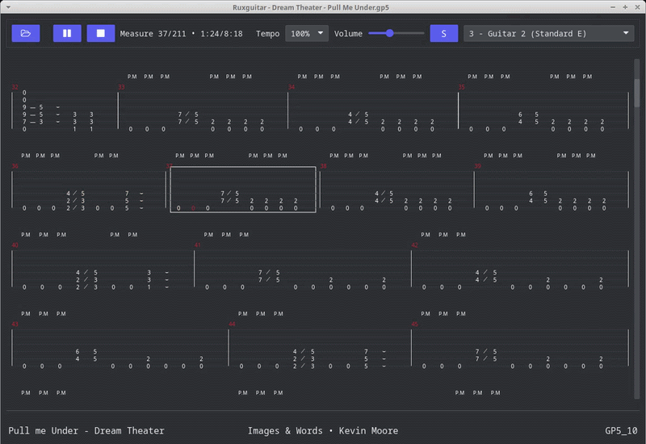

# ruxguitar

[](https://github.com/agourlay/ruxguitar/actions/workflows/ci.yml)
[](https://crates.io/crates/ruxguitar)

A guitar pro tablature player.

The design of the application is described in details in the blog article "[Playing guitar tablatures in Rust](https://agourlay.github.io/ruxguitar-tablature-player/)".



## Features

- GP4 and GP5 file support (drag-and-drop supported)
- MIDI playback with embedded soundfont (or custom soundfont)
- Repeat sections with alternative endings
- Tempo control (25% to 200%)
- Solo mode (isolate single track)
- Track selection
- Keyboard shortcuts:
    - `Space` play/pause
    - `Ctrl+Up` / `Ctrl+Down` tempo up/down
    - `Left` / `Right` previous/next measure
    - `S` toggle solo
    - `F11` toggle fullscreen

## Limitations

- no editing capabilities (read-only player)
- no score notation (tablature only)
- supports only GP5 and GP4 files

## Usage

```bash
./ruxguitar --help
Guitar pro tablature player

Usage: ruxguitar [OPTIONS]

Options:
      --sound-font-file <SOUND_FONT_FILE>  Optional path to a sound font file
      --tab-file-path <TAB_FILE_PATH>      Optional path to tab file to by-pass the file picker
      --no-antialiasing                    Disable antialiasing
  -h, --help                               Print help
  -V, --version                            Print version
```

A basic soundfont is embedded in the binary for a plug and play experience, however it is possible to provide a larger soundfont file to get better sound quality.

For instance I like to use `FluidR3_GM.sf2` which is present on most systems and easy to find online ([here](https://musical-artifacts.com/artifacts/738) or [there](https://member.keymusician.com/Member/FluidR3_GM/index.html)).

```bash
./ruxguitar --sound-font-file /usr/share/sounds/sf2/FluidR3_GM.sf2
```

## FAQ

- **Where can I find guitar pro files?**
  - You can find a lot of guitar pro files on the internet. For instance on [Ultimate Guitar](https://www.ultimate-guitar.com/).

- **Why is the sound quality so bad?**
  - The default soundfont is very basic. You can provide a better soundfont file using the `--sound-font-file` option.

- **Which dependencies are needed to run the application?**
  - Check the necessary dependencies for your system from the [CI configuration](https://github.com/agourlay/ruxguitar/blob/master/.github/workflows/ci.yml).

- **Why is the file picker not opening on Linux?**
  - Install the `XDG Destop Portal` package for your [desktop environment](https://wiki.archlinux.org/title/XDG_Desktop_Portal#List_of_backends_and_interfaces).

- **Why are the strings not rendered on the tablature?**
  - You might need to disable antialiasing using the `--no-antialiasing` option.

- **Does it run on Windows 7 or Windows 8?**
  - The last compatible release with those versions of Windows is [v0.6.3](https://github.com/agourlay/ruxguitar/releases/tag/v0.6.3).

- **Why is the sound not working on Linux?**
  - Getting the error `The requested device is no longer available. For example, it has been unplugged`.
  - You are most likely using `PulseAudio` or `Pipewire` which are not supported.
  - Install compatibility packages `pulseaudio-alsa` or `pipewire-alsa` (requires a restart of the audio service).

## Installation

### Releases

Using the provided binaries in https://github.com/agourlay/ruxguitar/releases

### Crates.io

Using Cargo via [crates.io](https://crates.io/crates/ruxguitar).

```bash
cargo install ruxguitar
```

### Build

Make sure to check the necessary dependencies for your system from the [CI configuration](https://github.com/agourlay/ruxguitar/blob/master/.github/workflows/ci.yml).

## Acknowledgements

This project is heavily inspired by the great [TuxGuitar](https://github.com/helge17/tuxguitar) project.